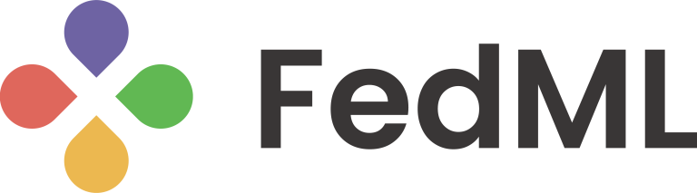

### Hi 👋, nice to e-meet you here:-) Please drop me an email if you are interested in my company or research.

<b>Open and Collaborative AI Anywhere at Any Scale</b>

- Founder and CTO of FedML, Inc (https://fedml.ai), a company building open and collaborative AI anywhere at any scale
- Ph.D. Degree in Computer Science, University of Southern California, Los Angeles, USA
- A lifelong learner with a strong passion and interest in scientific research, engineering, production, R&D team management, and entrepreneurship.
- My Homepage: https://chaoyanghe.com

I's looking for full-time/part-time researchers, engineers, interns to build products for FedML, Inc. If you are good at any area of Machine Learning (optimization, diverse learning paradigms), CV (embedded vision or cloud vision), NLP, Data Mining (e.g., graph neural networks), or Edge Computing (Android/iOS, IoTs, Web-React/Vue.js), Cloud Native Computing (e.g., Java Spring, Kubernetes), Distributed Systems (Distributed Training, NCCL, MQTT, RPC, MPI), Security/Privacy (MPC, DP, etc.), please drop me an email. See https://fedml.ai/careers/ for details.

<!--
**chaoyanghe/chaoyanghe** is a ✨ _special_ ✨ repository because its `README.md` (this file) appears on your GitHub profile.

Here are some ideas to get you started:

- 🔭 I’m currently working on ...
- 🌱 I’m currently learning ...
- 👯 I’m looking to collaborate on ...
- 🤔 I’m looking for help with ...
- 💬 Ask me about ...
- 📫 How to reach me: ...
- 😄 Pronouns: ...
- ⚡ Fun fact: ...
-->
